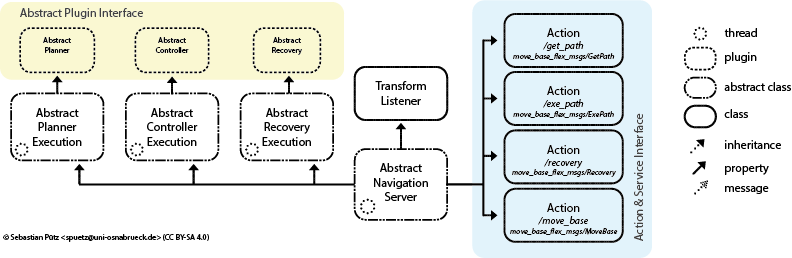

# Move Base Flex Abstract Navigation Server  {#mainpage}

The mbf_abstract_nav package contains the abstract navigation server implementation of Move Base Flex (MBF). The abstract navigation server is not bound to any map representation. It provides the Actions for planning, controlling and recovering. At the time of start MBF loads all defined plugins. Therefor, it loads all plugins which are defined in the lists *planners*, *controllers* and *recovery_behaviors*. Each list holds a pair of a *name* and a *type*. The *type* defines which kind of plugin to load. The *name* defines under which name the plugin should be callable by the actions.

