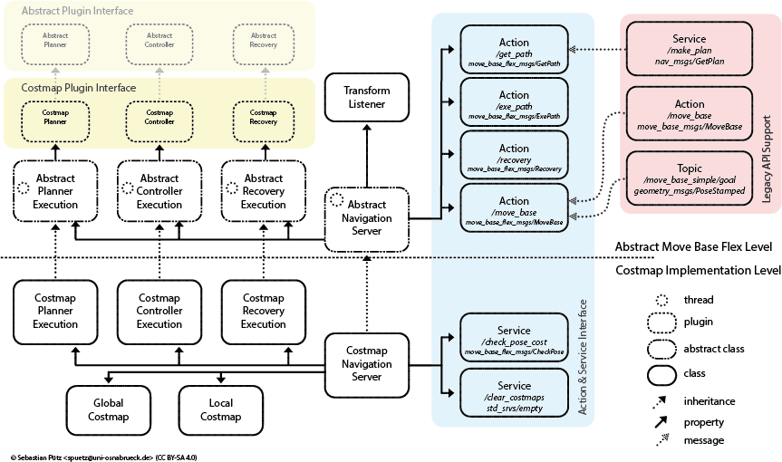

# Move Base Flex Costmap Navigation Server {#mainpage}

The mbf_costmap_nav package contains the costmap navigation server implementation of Move Base Flex (MBF). The costmap navigation server is bound to the [costmap_2d](http://wiki.ros.org/costmap_2d) representation. It provides the Actions for planning, controlling and recovering. At the time of start MBF loads all defined plugins. Therefor, it loads all plugins which are defined in the lists *planners*, *controllers* and *recovery_behaviors*. Each list holds a pair of a *name* and a *type*. The *type* defines which kind of plugin to load. The *name* defines under which name the plugin should be callable by the actions. 

Additionally the mbf_costmap_nav package comes with a wrapper for the old navigation stack and the plugins which inherits from the [nav_core](http://wiki.ros.org/nav_core) base classes. Preferably it tries to load plugins for the new api, therefore plugins could even support both [move_base](http://wiki.ros.org/move_base) and [move_base_flex](http://wiki.ros.org/move_base_flex) by inheriting both base classes.

